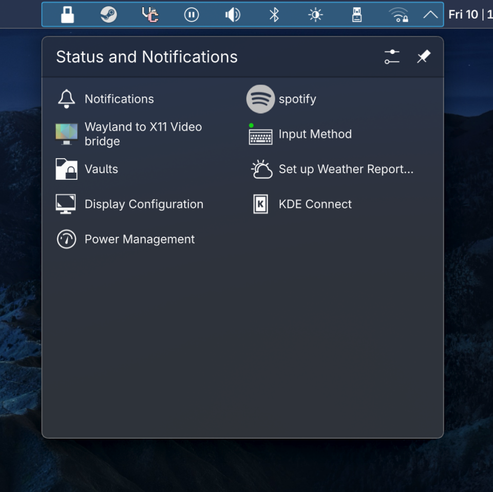

# Sugar Honey Ice & Tea™

Just a simple Plasma Style which modernizes panels while staying relatively close to stock KDE Plasma.
To install it, you just copy the plasma directory to ~\.local\share.

